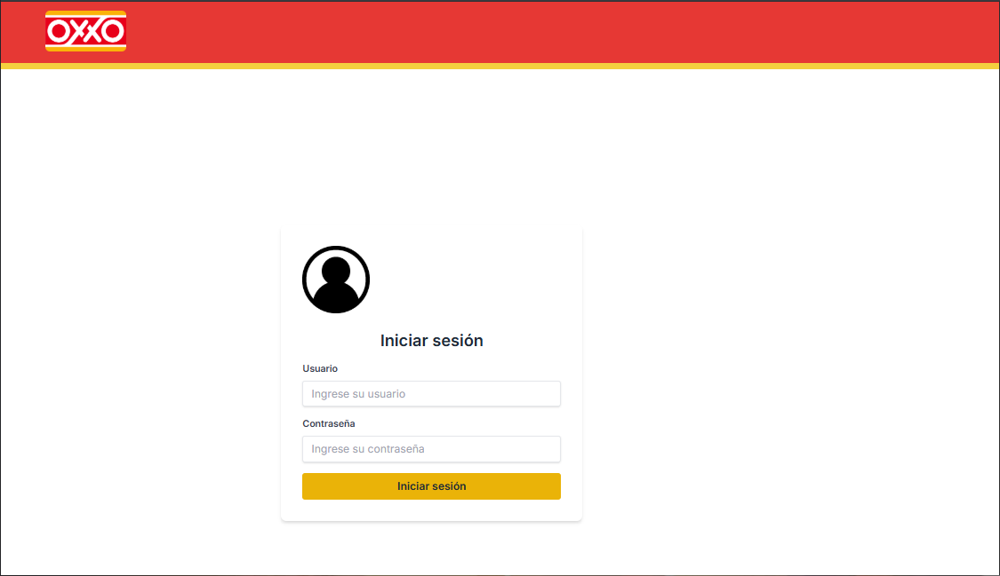
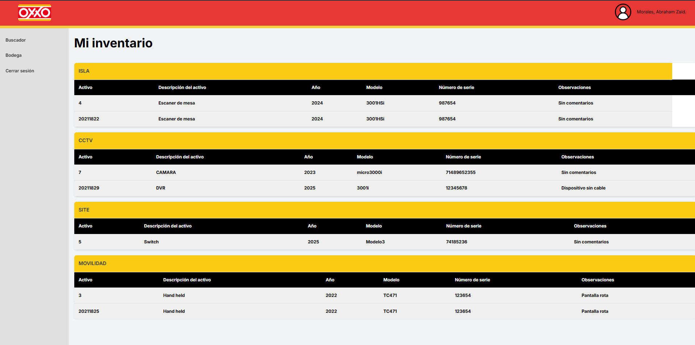
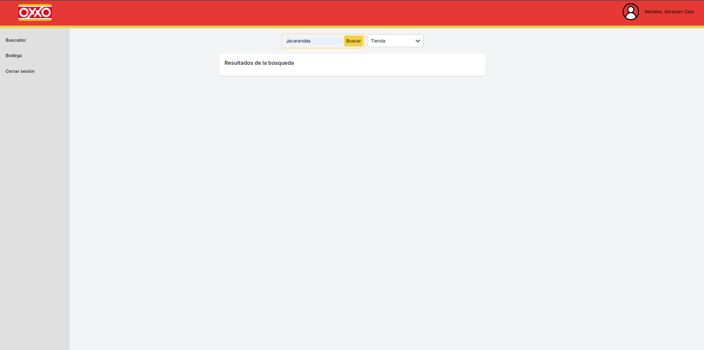
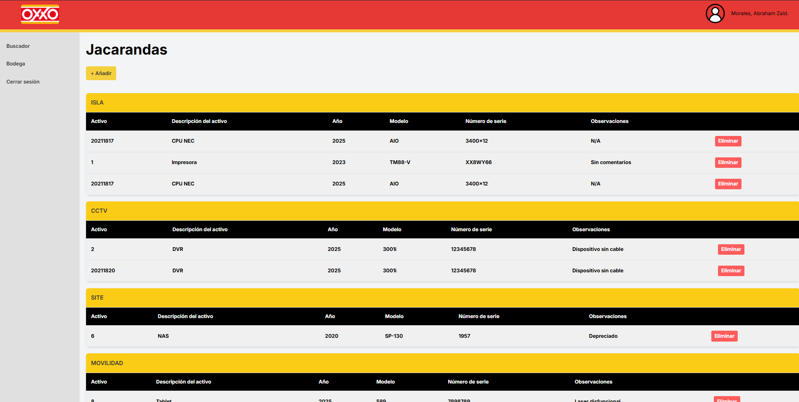
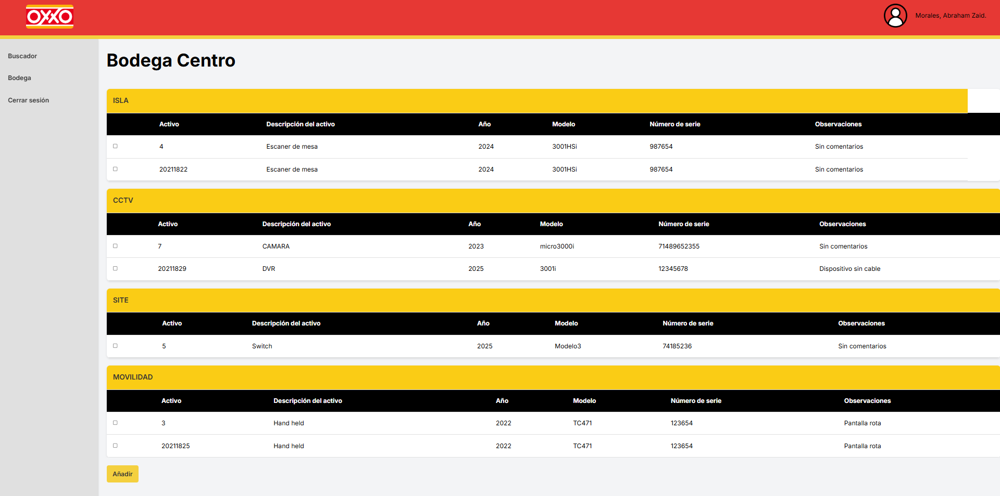
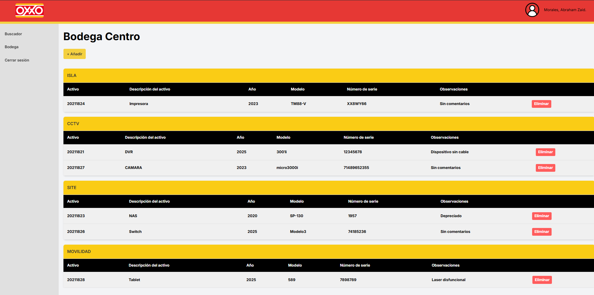

# Inventario dinámico Oxxo
¿Problemas con la trazabilidad para tu inventario? ¡Esta es tu solución!

Con esta plataforma web se busca desarrollar una plataforma web para la gestión de activos fijos en el área de sistemas de Oxxo, que permita registrar y rastrear sus movimientos en tiempo real, asegurando una trazabilidad eficiente.

Para poder empezar a operar en el sistema, obligatoriamente se debe poder iniciar sesión.

  <strong>Inicio de sesión</strong>
   
  

Una vez iniciada la sesión, la página va a dirigir a diferentes index según el rol del usuario. En caso de los técnicos, mostrará el inventario que lleva encima; mientras que, en el caso de un coordinador o un TI, mostraría un dashboard con puntos clave para el manejo de operaciones.

  <strong>Página principal</strong>
   
  

Una de las funciones principales que tiene el sistema es el buscador de tiendas, para poder acceder al inventario de cada una de las sucursales de Oxxo para poder administrar el activo fijo ubicado en tienda.

  <strong>Buscador</strong>
   
  

  <strong>Tienda</strong>
   
  

En caso de que se deseé dejar equipo en tienda, ya sea por un cambio dinámico o por una integración, se desplegará una lista con el inventario que tiene el usuario para poder registrar la instalación del equipo. Evitando así que se creen duplicados de datos o que haya errores en el registro del activo, el único capaz de crear activos en el sistema sería un usuario con rol de TI.

  <strong>Agregar</strong>
   
  

De igual forma, se puede acceder a una bodega asignada al usuario, para registrar el equipo que deja en la bodega física y que ya no llevará consigo encima.

  <strong>Bodega</strong>
   
  

